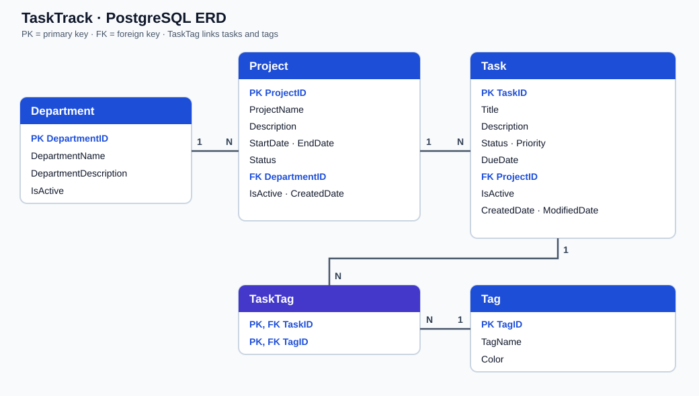

# TaskTrack API · PRN232 Assignment 1

Public ASP.NET Core 8 Web API for managing departments, projects, tasks, and tags. The solution has three projects: `TaskTrack.API` for HTTP endpoints, `TaskTrack.Service` for business rules, and `TaskTrack.Repo` for EF Core database access.

## Database ERD

The schema and seed data come from `TaskManagementDB_Postgres.sql` supplied with the assignment. `TaskTag` implements the many-to-many relationship between tasks and tags. The entities and `TaskTrackDbContext` use the database-first schema; do not run migrations that change the supplied schema.

## Run locally

1. Initialize PostgreSQL with the supplied SQL script.
2. Set `ConnectionStrings__DefaultConnection` or `DATABASE_URL` in your environment (or use local ASP.NET Core user secrets). `.env.example` documents the variables; .NET does not load a `.env` file automatically. Keep real credentials out of Git.
3. From the repository root, run `dotnet restore` and `dotnet run --project TaskTrack.API`.

Swagger is available at `/swagger`. The deployed API is at [Render](https://qe190117-se19b-ass1-be.onrender.com/swagger), and the [frontend](https://prn232-as01.vercel.app/) is deployed on Vercel.

## API behavior

- Departments and projects support public CRUD and search; deletion is rejected when child records exist.
- Tasks support public CRUD and multi-criteria search. DELETE soft-deletes a task by setting `IsActive` to false.
- Tags support public CRUD; deletion is rejected while any task uses the tag.
- CORS allows the local frontend and the deployed Vercel origin.
